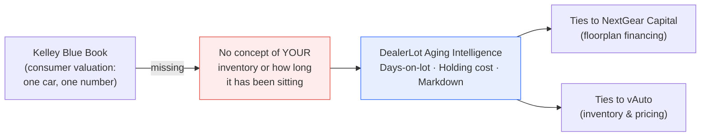

# PRD-01 — Aging & Holding-Cost Intelligence ("Days-on-Lot")

| | |
|---|---|
| **Product** | DealerLot |
| **Feature** | Inventory aging, holding cost, and aging-markdown recommendations |
| **Status** | 🟢 Approved — signed off 2026-06-25 |
| **Author** | Jaspal Singh Kahlon |
| **Date** | 2026-06-25 |
| **Reviewers** | (you) |

---

## 1. Summary

Add inventory-aging awareness to DealerLot. For every car we track **how long it has
been on the lot**, translate that into a **real dollar holding cost** (floorplan interest
+ daily overhead), and **recommend a specific price markdown** once a car ages past healthy
thresholds — e.g. *"Day 62 · drop $1,200 → $18,300 to clear."*

This turns the lot view from *"what is this car worth?"* (a KBB-style lookup) into
*"what is this car costing me, and what should I do about it today?"* — a question KBB
structurally cannot answer.



---

## 2. Problem & Opportunity

**The dealer pain.** Aging inventory silently bleeds money. Every day a car sits unsold, the
dealer pays *floorplan interest* on the money they borrowed to buy it, and the car keeps
depreciating. A unit at day 70 isn't just "not sold yet" — it is actively losing money each day,
and most managers can't see that cost per car.

**Why KBB can't solve it.** KBB is a consumer, point-in-time valuation. It knows nothing about
*this dealer's* lot, what they paid, or how long a specific unit has sat. Aging is, by definition,
outside its model.

**Why this is a fit for Cox.** Floorplan financing is literally **NextGear Capital**; inventory
and pricing is **vAuto**. This feature sits precisely in the seam between two businesses Cox
already owns — making the lot's *cost of time* visible and actionable.

**Why it's a strong portfolio signal.** It demonstrates dealer-operations product thinking, not
just a valuation clone — exactly the "explore solutions that could fit the organization / evangelize
new ideas" energy the JD asks for.

---

## 3. Goals, Non-Goals, Success Metrics

**Goals**
- Every car displays **days-on-lot** and an **aging status**.
- Every car shows its **accumulated and per-day holding cost** in dollars.
- The system produces a **concrete markdown recommendation** (amount + target price) when a car
  is aging *and* mispriced relative to market.
- These recommendations feed a **prioritized action list**, ranked by dollar impact.

**Non-Goals (this iteration)**
- Live external market feeds or real NextGear API integration.
- Authentication, multi-dealer tenancy.
- **Auto-applying** price changes — we *recommend*; a human approves. (Safety + trust.)

**Success Metrics**
- % of aging cars that carry an actionable recommendation.
- Total **holding cost surfaced** and **margin-at-risk flagged** across the lot.
- (Demo) The seed reproduces a believable spread of Fresh / Aging / Stale / Critical cars.

---

## 4. Users & Jobs-to-be-Done

| User | Job-to-be-done |
|---|---|
| **Used-car / inventory manager** (primary) | "Tell me which cars are costing me money and what to do about them today." |
| **GM / owner** (secondary) | "How much is aging costing the lot, and is it getting better or worse?" |

---

## 5. Key Concepts & Definitions

- **Days-on-Lot (DOL):** `today − intake_date`.
- **Aging band:** Fresh (0–30) · Aging (31–45) · Stale (46–60) · Critical (60+). *(decision #2)*
- **Cost basis:** the acquisition cost the dealer financed for the unit. *(decision #1)*
- **Holding cost / day:** `(cost_basis × APR ÷ 365) + daily_overhead`. *(decision #3)*
- **Holding cost to date:** `holding_cost_per_day × DOL`.
- **Aging markdown:** when a car crosses an aging band *and* its asking price sits above the
  model's market band, recommend dropping it toward a faster-selling price. *(decision #4)*

---

## 6. Functional Requirements (user stories)

1. As a manager, I can see each car's **days-on-lot** and a colored **aging badge**.
2. As a manager, I can see each car's **holding cost to date** and **per day**.
3. As a manager, I get a **recommended action** when a car is aging + overpriced
   ("Day 62 · drop $1,200 → $18,300").
4. As a manager, I can **filter to aging cars** and see recommendations **ranked by $ impact**.
5. As a GM, I can see **total holding cost** and **margin-at-risk** for the lot (Reports).
6. As a manager, I **approve** a recommendation to apply the new price (no silent auto-changes).

---

## 7. Proposed Business Logic *(for validation)*

**Holding cost**
```
holding_cost_per_day = (cost_basis × APR / 365) + daily_overhead
APR default          = 9%   (configurable per dealership)
daily_overhead       = $12  (insurance, lot, reconditioning amortization)
```

**Markdown engine** (recommendation only)
```
Fresh / Aging  → no markdown unless price is far above market band.
Stale          → if asking > market_high, recommend drop to market_high.
Critical       → recommend drop to market_low to clear (aggressive).
Step cap       → never recommend more than the larger of $X or Y% in one step.
```
Aggressiveness of the Critical step is **decision #4**.

---

## 8. UX Surfaces

- **Inventory table:** new **Days** column + aging badge; recommendation shown inline.
- **New "Aging" filter** chip / view.
- **Reports:** total holding cost, margin-at-risk, count by aging band.
- **(Future) Daily action list** / scheduled morning digest.

---

## 9. Data Model Changes

Add to `vehicles`:
- `intake_date` (DATE, NOT NULL, default today) — when the unit hit the lot.
- `cost_basis` (INTEGER, nullable) — acquisition cost. *(decision #1)*

Derived at request time (not stored): `days_on_lot`, `aging_band`,
`holding_cost_to_date`, `holding_cost_per_day`, `recommendation`.

---

## 10. Assumptions, Open Questions, Risks

- **Assumption:** demo uses synthetic intake dates spread across 0–80 days.
- **Risk:** recommendations must be **conservative and explainable** — never push a fire-sale.
  Each recommendation should state its reason ("Critical age + $3k over market").
- **Open questions:** captured as the four decisions below.

---

## 11. Out of Scope / Dependencies

- Out of scope: real floorplan rates per lender, tax/title, reconditioning workflows.
- Depends on: the existing `ValuationService` (provides the market band the markdown uses).

---

## 12. High-Level Roadmap *(detailed in the Spec after sign-off)*

| Milestone | Content |
|---|---|
| **M1** | Data model (`intake_date`, `cost_basis`) + DOL & holding-cost compute + tests |
| **M2** | Markdown recommendation engine + tests |
| **M3** | UI surfaces: Days column, aging badges, Aging filter, Reports additions |
| **M4** | Prioritized action list (and optional scheduled daily digest) |

---

## 13. Decisions — SIGNED OFF ✅ (2026-06-25)

1. **Cost basis** → **Add an acquisition-cost field.** True floorplan interest; unlocks gross-profit later.
2. **Aging bands** → **Standard 4-band:** Fresh 0–30 · Aging 31–45 · Stale 46–60 · Critical 61+.
3. **Holding cost model** → **Floorplan interest + flat daily overhead.**
4. **Markdown aggressiveness** → **Balanced:** Stale nudges to market high; Critical drops toward market low.
