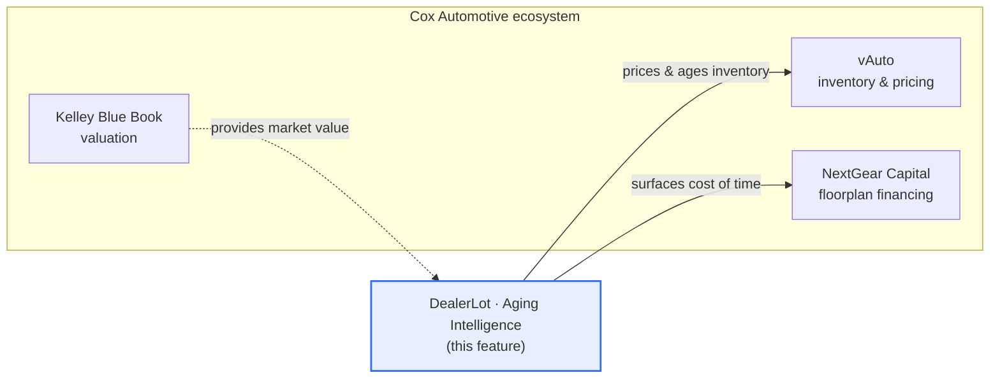
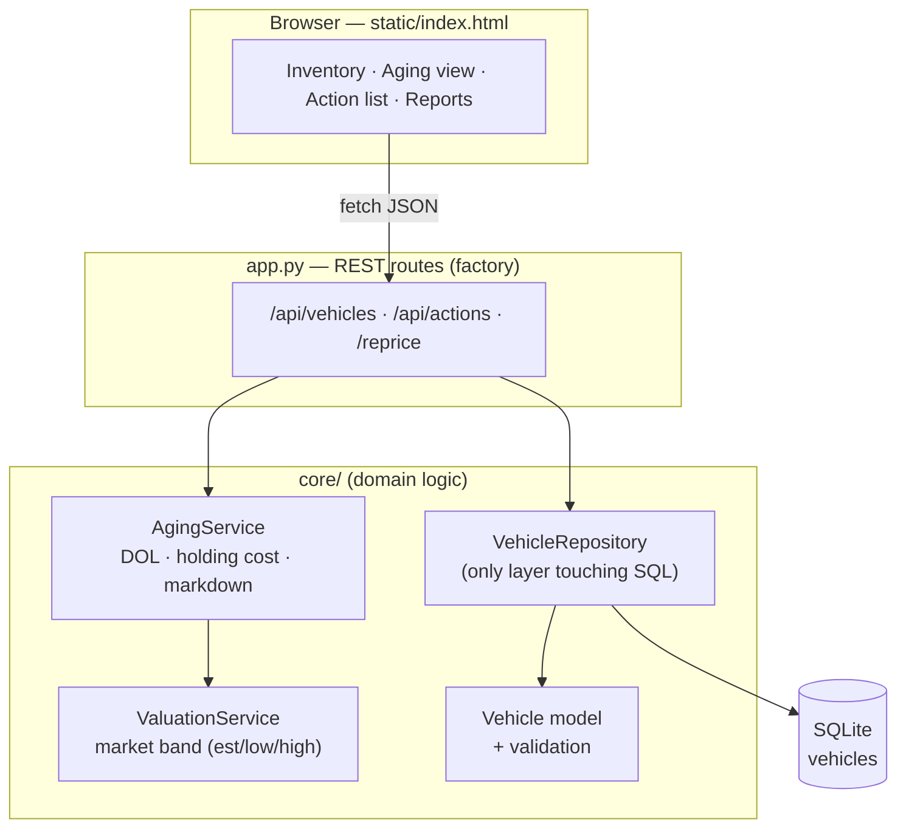
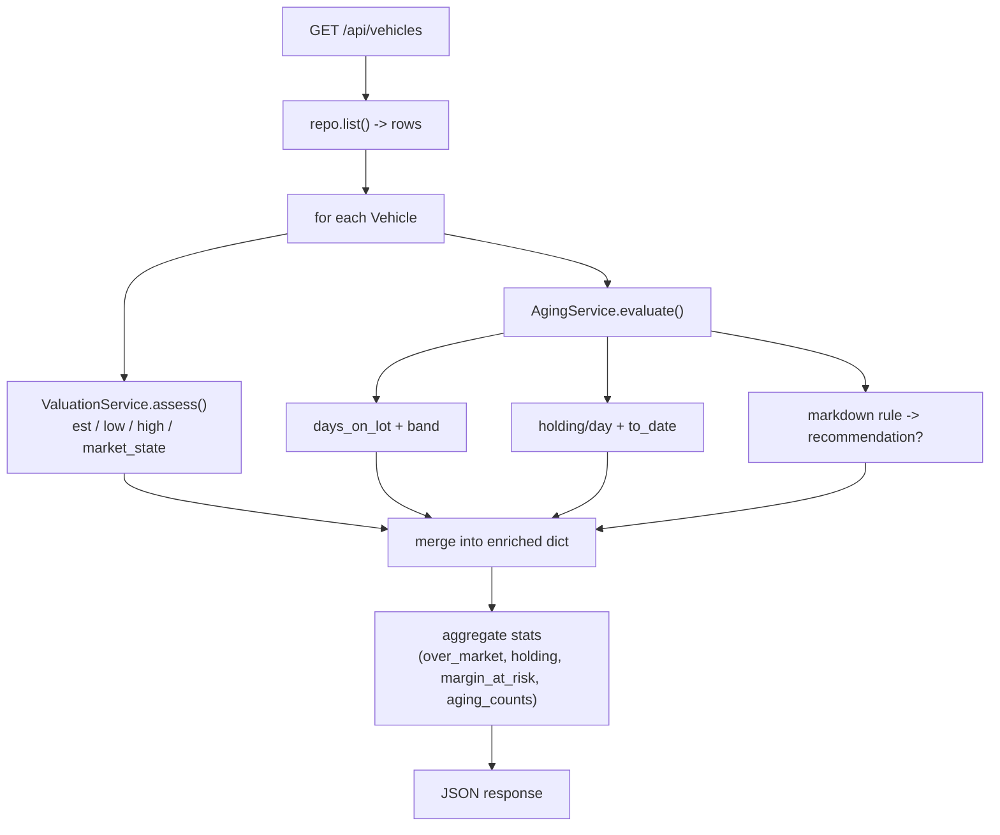
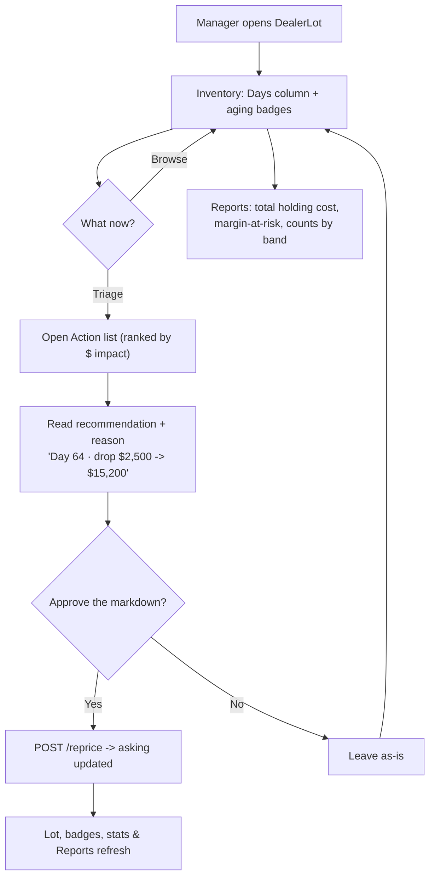

# SPEC-01 — Aging & Holding-Cost Intelligence

| | |
|---|---|
| **Implements** | [PRD-01](./PRD-01-days-on-lot.md) (🟢 approved) |
| **Status** | Ready to build |
| **Author** | Jaspal Singh Kahlon · 2026-06-25 |

Locked decisions: acquisition **cost basis** field · **4-band** aging (30/45/60) ·
holding = **floorplan interest + flat overhead** · **balanced** markdown.

---

## 1. Scope

Add, to the existing DealerLot service:
1. Two stored columns (`intake_date`, `cost_basis`) + a safe migration.
2. An `AgingService` that computes days-on-lot, aging band, holding cost, and a markdown
   recommendation (using the existing `ValuationService` for the market band).
3. API enrichment + two new endpoints (`/api/actions`, `/reprice`).
4. UI surfaces: Days column, aging badges, an **Aging** filter, an **Action list**, and
   Reports additions.
5. Tests for every rule.

---

## 2. Where this applies (context)


The feature consumes a **market value** (KBB-like, our `ValuationService`) and produces
**operational decisions** about *time and money* — the seam between vAuto and NextGear.

---

## 3. Architecture flow


`AgingService` is new and depends on `ValuationService`; routes orchestrate, the repository
stays the only SQL owner. No existing layer's responsibility changes.

---

## 4. Data model

```sql
ALTER TABLE vehicles ADD COLUMN intake_date TEXT NOT NULL DEFAULT (date('now'));
ALTER TABLE vehicles ADD COLUMN cost_basis  INTEGER;   -- nullable; acquisition cost
```

**Migration** (idempotent, runs in `init_db`): read `PRAGMA table_info(vehicles)`; if a column
is absent, `ALTER TABLE ADD COLUMN`. Existing rows get `intake_date = today` and `cost_basis = NULL`.

**Null cost basis fallback:** when `cost_basis` is missing, holding cost uses
`est_value × 0.90` as a proxy so legacy rows still work (documented, not silent).

**Seed update:** each of the 12 cars gets an `intake_date` spread across ~5–75 days ago and a
`cost_basis` ≈ `est_value × 0.85` (dealers buy below retail), producing a realistic spread of
Fresh / Aging / Stale / Critical and a few live recommendations.

---

## 5. Algorithms

### 5.1 Days-on-lot & aging band
```
days_on_lot = (today - intake_date).days
band = Fresh    if days <= 30
       Aging    if 31..45
       Stale    if 46..60
       Critical if >= 61
```
Badge colors: Fresh green · Aging amber · Stale orange · Critical red.

### 5.2 Holding cost
```
APR            = env HOLDING_APR            default 0.09
daily_overhead = env HOLDING_DAILY_OVERHEAD default 12
basis          = cost_basis  (or est_value*0.90 if null)

holding_per_day = basis * APR / 365 + daily_overhead
holding_to_date = holding_per_day * days_on_lot
```

### 5.3 Markdown engine (balanced) — recommendation ONLY
Inputs: `asking`, market band `(low, est, high)` from ValuationService, `band`.
```
target = None
if band in (Fresh, Aging):
    if asking > high * 1.10:  target = high        # only if FAR over market
elif band == Stale:
    if asking > high:         target = high        # nudge to market high
elif band == Critical:
    if asking > low:          target = low          # drop to clear

if target is None or target >= asking:
    recommendation = None
else:
    raw_drop = asking - target
    cap      = max(2500, round(0.10 * asking))      # never > $2.5k or 10% in one step
    drop     = min(raw_drop, cap)
    new_price = round_to_100(asking - drop)
    recommendation = { target_price, drop, reason }
```
`reason` example: `"Critical age (62 days) + $3,000 over market"`.

### 5.4 Action-list priority
```
impact = recommended drop ($)         # dollars at stake in the decision
rank:  impact DESC, then days_on_lot DESC
```

### 5.5 Worked example (the seed F-150)
```
2019 Ford F-150 · intake 64 days ago · cost_basis $11,500 · asking $17,700
est band: low 11,700 · est 13,500 · high 15,700
band            = Critical (64 > 60)
holding/day     = 11,500 * 0.09/365 + 12  = 2.84 + 12 = $14.84
holding_to_date = 14.84 * 64              = $950
markdown        = Critical, asking 17,700 > low 11,700 -> target = low 11,700
raw_drop 6,000  -> cap max(2500, 1770)=2500 -> drop 2,500 -> new_price 15,200
recommendation  = "Day 64 · drop $2,500 -> $15,200 (Critical age + over market)"
```

---

## 6. API changes

**Enriched vehicle object** (added fields):
```
intake_date, days_on_lot, aging_band,
cost_basis, holding_cost_per_day, holding_cost_to_date,
recommendation: { target_price, drop, reason } | null
```

**New / changed endpoints**
| Method | Path | Purpose |
|---|---|---|
| GET | `/api/actions` | Cars with a recommendation, ranked by impact + lot totals |
| POST | `/api/vehicles/<id>/reprice` | Apply a new asking price (human approves a rec). Body `{price}`; default = recommended target |
| POST | `/api/vehicles` | now also accepts `intake_date`, `cost_basis` |

**Stats additions** on `/api/vehicles`:
```
total_holding_cost   # sum holding_to_date for available cars
margin_at_risk       # sum of (asking - est) for over-market cars
aging_counts         # {fresh, aging, stale, critical}
```

---

## 7. Process flow (request → enriched response)



---

## 8. User flow



---

## 9. UX surfaces (detail)

- **Inventory table:** new **Days** column showing `Nd` + a small band badge; if a car has a
  recommendation, show a one-line hint under the price check ("↓ drop $2,500 → $15,200").
- **Aging filter chip:** "Aging 60+" (or band chips) to focus the stale/critical cars.
- **Action list** (new tab or panel): ranked recommendations, each with an **Approve** button →
  `/reprice`. Header shows totals ("3 actions · $6,200 of markdowns · $950 holding burned").
- **Reports:** add Total holding cost, Margin-at-risk, and a Fresh/Aging/Stale/Critical breakdown.

---

## 10. Test plan

| Test | Asserts |
|---|---|
| `days_on_lot` math | intake 10 days ago → 10 |
| band boundaries | 30→Fresh, 31→Aging, 46→Stale, 61→Critical |
| holding cost formula | known basis/APR → expected per-day & to-date |
| null cost basis | falls back to est_value proxy, no crash |
| markdown: fresh over-market | only fires when >10% over high |
| markdown: critical | drops toward low, respects step cap |
| markdown: under-market car | no recommendation |
| `/api/actions` ordering | sorted by impact desc |
| `/reprice` | updates asking, returns enriched car |
| stats | total_holding_cost & margin_at_risk computed |

---

## 11. Roadmap

| Milestone | Deliverables | Acceptance |
|---|---|---|
| **M1 — Data & cost** | migration, `intake_date`/`cost_basis`, seed update, `AgingService` (DOL + holding cost), tests | every car returns days_on_lot, band, holding cost; tests green |
| **M2 — Markdown engine** | balanced markdown rules + step cap + reason strings, tests | recommendations correct across all four bands |
| **M3 — UI surfaces** | Days column, badges, Aging filter, Reports additions | UI matches design language; live data |
| **M4 — Action list** | `/api/actions`, Action-list panel, `/reprice` + Approve flow | manager can approve a markdown and see the lot update |
| **M5 (opt) — Daily digest** | scheduled morning "today's actions" summary | runs on a schedule |

---

## 12. Edge cases & risks

- **No recommendation is the common case** — most cars should *not* be flagged; avoid alert fatigue.
- **Step cap** prevents recommending a fire-sale in one move.
- **Every recommendation carries a reason** (explainability) — never a bare number.
- **Reprice is human-approved**; the system never changes a price on its own.
- Future cars with missing `cost_basis` must not break holding-cost math (proxy fallback).
